# HANGMAN

Hangman is a Python terminal game, wich runs in the Code Institute mock terminal on Heroku.

Users can try to beat the computer by finding all of the letters in the word or guessing the word that the computer randomly selects.
Users have 6 tries before they get "hanged" and looses.

[Here is the live version of my project.](https://py-hangman.herokuapp.com/)
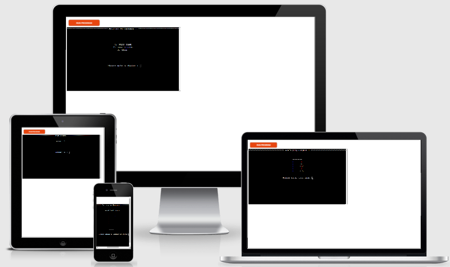

## How to play
Hangman is a pen-and-paper game in a guessing form.
In this game the user enters their name and the computer selects a random word that gets 
displayed as "_______" and with graphics of a hangman in different stages.
If user guesses a letter thats in the word it displays in the terminal on the line in it´s right position in the word.
When the user guesses the whole word they win and can choose to play again or exit to the welcome screen.
If the user can´t guess the word before their 6 turns is over they looses.

# Features
## Existing features
    * Welcome screen.
    * With multiple choices.
    * accept user inputs

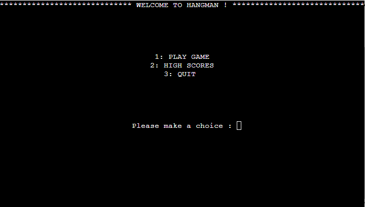

    * High Score area.
    * Presents the top 5 players.
    * accept user inputs

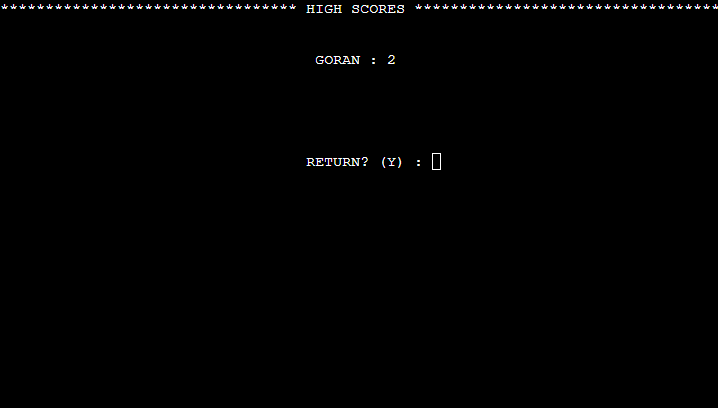

    * Getting player name.
    * accept user inputs

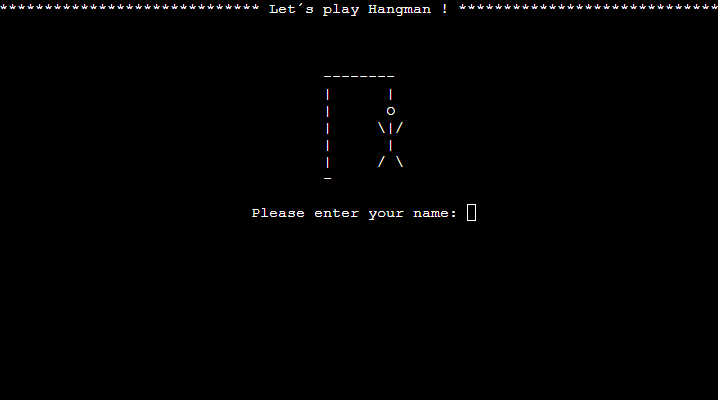

    * The game.
    * Maintains score.
    * Play aginst the computer.
    * accept user inputs

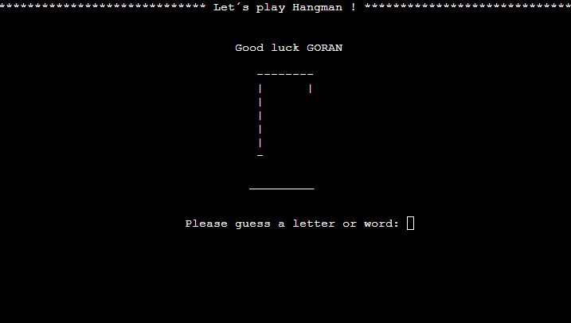

    * Input validation and error-checking.
        * try: except statement for FileNotFoundError, KeyError and ValueError
          for the json file with the high scores.
        * Not a valid guess, try again.
        * Must choose 1, 2 or 3 !
        * Try again !
        * Must choose letters.
        * Must choose Y or No.

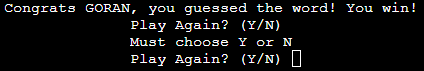
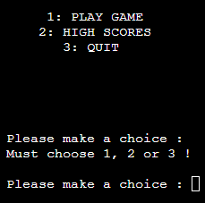
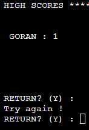
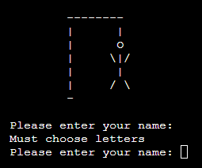
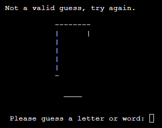

# Flowchart
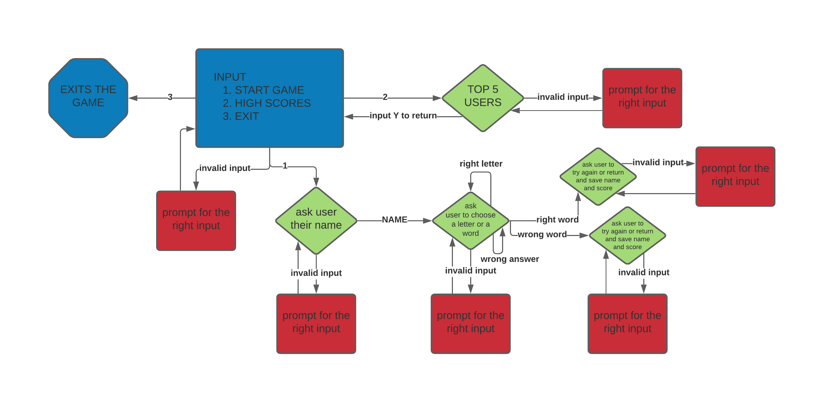

## Future features
    * Different levels of difficulty.
    * Multiplayers

# Testing
I have manually tested this project by doing the following:
    * Passed the code through a PEP8 linter and confirmed there are no problems.
    * Given invalid inputs: strings when numbers are excepted, out of bounds inputs, same input twice.
    * Tested in my local terminal and the Code Institute Heroku terminal.

# Bugs
    * High scores overrides with latest game result.
        * Fixed by add an if statement to check if user scores are higher or not before updating json.
    
    * Game result win, have to type N twice to return to welcome screen.
        * Fixed by change 2 input to print statesment.

# No bugs remaining.

# Validator testing
    * PEP8 
        * No errors were returned from [PEP8online](http://pep8online.com/)

# Deployment
    * Steps for deployment
        * Fork or clone this repository
        * Create a new Heroku app
        * Set the buildbacks to Pyhton and NodeJS in that order
        * Link the Heroku app to repository
        * Click on Deploy

# Credits
    * Code Institute for the deployment terminal
    * Fellow coders in stackoverview
    * youtube videos